# WWGiles AI-Augmented Business Excellence
## BSC Cause-Effect Strategy: From Survival to Market Leadership

**Version:** 2.0 | **Date:** December 2025 | **Classification:** Executive Summary

---

## Executive Summary: The £12.5M Opportunity

WWGiles operates at **10.5% gross margin** against an industry average of **15-20%**, placing the business in the **bottom quartile** and acquisition target territory. This document presents an integrated AI strategy delivering **£12.5M additional value over 36 months** through four interconnected cause-effect chains.

### The Core Problem: Invisible Margin Erosion

```mermaid
flowchart LR
    subgraph VISIBLE["📊 What Sales Sees"]
        A[Order Placed<br/>Expected 18% GP]
    end
    
    subgraph INVISIBLE["🔴 What Actually Happens"]
        B[Vessel Delay<br/>+3 days storage]
        C[Customer Pickup<br/>+5 days storage]
        D[Substitutions<br/>Lower margin]
        E[Finance Cost<br/>Working capital drag]
    end
    
    subgraph REALITY["💰 Realized Outcome"]
        F[Actual GP: 10.5%<br/>£450K Annual Leak]
    end
    
    A --> B --> C --> D --> E --> F
    
    style VISIBLE fill:#e8f5e9,stroke:#2e7d32
    style INVISIBLE fill:#ffebee,stroke:#c62828
    style REALITY fill:#fff3e0,stroke:#ef6c00
```

### Investment vs Return Summary

| Metric | Value |
|--------|-------|
| **Total Investment** | £400,000 over 36 months |
| **Year 1 Benefit** | £1.82M |
| **Year 3 Cumulative Benefit** | £12.5M |
| **Payback Period** | 8 months |
| **Portfolio ROI** | 31:1 |

---

## BSC Strategy Map: Cause-Effect Architecture

The transformation is driven by **four interconnected causal chains** flowing from Learning & Growth foundations through Internal Processes and Customer outcomes to Financial results.

```mermaid
flowchart BT
    subgraph FINANCIAL["💰 FINANCIAL PERSPECTIVE"]
        direction LR
        F1["<b>F1: Increase Realized GP</b><br/>10.5% → 22%<br/>+£6.1M Year 3"]
        F2["<b>F2: Reduce Finance Costs</b><br/>£520K → £180K<br/>-65% reduction"]
        F3["<b>F3: Accelerate Cash</b><br/>89 → 45 days<br/>£8M freed"]
        F4["<b>F4: Grow Revenue</b><br/>£53M → £65M<br/>+23% growth"]
    end
    
    subgraph CUSTOMER["👥 CUSTOMER PERSPECTIVE"]
        direction LR
        C1["<b>C1: Target Premium Buyers</b><br/>Best price, fast payment"]
        C2["<b>C2: Reduce DSO</b><br/>47 → 25 days"]
        C3["<b>C3: Price Realization</b><br/>88% → 95%"]
        C4["<b>C4: Retention</b><br/>85% → 95%"]
    end
    
    subgraph PROCESS["⚙️ INTERNAL PROCESS PERSPECTIVE"]
        direction LR
        P1["<b>P1: GP Guardian</b><br/>Booked→Current→Realized<br/>Real-time tracking"]
        P2["<b>P2: AI Smart CRM</b><br/>Customer profitability<br/>Inventory matching"]
        P3["<b>P3: Dynamic Pricing</b><br/>Risk-adjusted quotes<br/>Margin protection"]
        P4["<b>P4: Pipeline Visibility</b><br/>Source→Sold→Paid<br/>End-to-end view"]
    end
    
    subgraph LEARNING["📚 LEARNING & GROWTH PERSPECTIVE"]
        direction LR
        L1["<b>L1: AI Deployment</b><br/>GP Guardian + CRM<br/>Platform foundation"]
        L2["<b>L2: Data Quality</b><br/>60% → 95%<br/>CRM discipline"]
        L3["<b>L3: Sales Enablement</b><br/>AI tool adoption<br/>20% → 95%"]
        L4["<b>L4: Process Automation</b><br/>15% → 80%<br/>Repeatable tasks"]
    end
    
    %% Cause-Effect Links
    L1 --> P1
    L1 --> P2
    L2 --> P2
    L3 --> P3
    L4 --> P4
    
    P1 --> C3
    P2 --> C1
    P2 --> C4
    P3 --> C3
    P4 --> C2
    
    C1 --> F1
    C1 --> F4
    C2 --> F3
    C3 --> F1
    C4 --> F4
    
    F3 --> F2
    F1 --> F2

    style FINANCIAL fill:#c8e6c9,stroke:#2e7d32,stroke-width:2px
    style CUSTOMER fill:#bbdefb,stroke:#1565c0,stroke-width:2px
    style PROCESS fill:#ffe0b2,stroke:#ef6c00,stroke-width:2px
    style LEARNING fill:#e1bee7,stroke:#7b1fa2,stroke-width:2px
```

---

## The Four Causal Chains

### Chain 1: Margin Recovery Chain 💰
**Primary Outcome:** Recover £6.1M Additional GP by Year 3

```mermaid
flowchart LR
    subgraph L["LEARNING"]
        L1["Deploy GP Guardian<br/>AI cost allocation"]
    end
    
    subgraph P["PROCESS"]
        P1["Real-time cost<br/>allocation to orders"]
    end
    
    subgraph C["CUSTOMER"]
        C1["Price realization<br/>88% → 95%"]
    end
    
    subgraph F["FINANCIAL"]
        F1["Realized GP<br/>10.5% → 22%"]
    end
    
    L1 -->|"enables"| P1 -->|"drives"| C1 -->|"delivers"| F1
    
    style L fill:#e1bee7,stroke:#7b1fa2
    style P fill:#ffe0b2,stroke:#ef6c00
    style C fill:#bbdefb,stroke:#1565c0
    style F fill:#c8e6c9,stroke:#2e7d32
```

| Stage | Initiative | Metric | Current | Target |
|-------|------------|--------|---------|--------|
| Learning | GP Guardian AI Deployment | Order-level GP visibility | 0% | 100% |
| Process | Real-time Cost Allocation | Cost attribution within 24hrs | 0% | 95% |
| Customer | Price Realization Discipline | Actual/List price ratio | 88% | 95% |
| Financial | Realized GP Margin | Gross margin % | 10.5% | 22% |

**Owner:** CFO/COO | **Investment:** £92K | **Year 3 Benefit:** £1.5M annually

---

### Chain 2: Cash Acceleration Chain 💵
**Primary Outcome:** Free £8M Working Capital, Save £520K Finance Costs

```mermaid
flowchart LR
    subgraph L["LEARNING"]
        L1["Source-to-Paid<br/>pipeline visibility"]
    end
    
    subgraph P["PROCESS"]
        P1["Velocity optimization<br/>each pipeline stage"]
    end
    
    subgraph C["CUSTOMER"]
        C1["DSO reduction<br/>47 → 25 days"]
    end
    
    subgraph F["FINANCIAL"]
        F1["Cash cycle<br/>89 → 45 days<br/>£8M freed"]
        F2["Finance cost<br/>-£340K/year"]
    end
    
    L1 -->|"enables"| P1 -->|"drives"| C1 -->|"delivers"| F1 -->|"reduces"| F2
    
    style L fill:#e1bee7,stroke:#7b1fa2
    style P fill:#ffe0b2,stroke:#ef6c00
    style C fill:#bbdefb,stroke:#1565c0
    style F fill:#c8e6c9,stroke:#2e7d32
```

**Cash Conversion Cycle Breakdown:**

| Pipeline Stage | Current | Target | Improvement |
|----------------|---------|--------|-------------|
| Procurement → Landing | 21 days | 18 days | -3 days |
| Landing → Sale | 12 days | 6 days | -6 days |
| Sale → Invoice | 3 days | 0 days | -3 days |
| Invoice → Payment | 47 days | 25 days | -22 days |
| **Total Cycle** | **89 days** | **45 days** | **-44 days** |

**Owner:** CFO | **Investment:** £78K | **Year 3 Benefit:** £1.6M annually

---

### Chain 3: Customer Optimization Chain 👥
**Primary Outcome:** Focus Resources on Profitable Customers

**Customer Profitability Matrix:**

| Customer Tier | Revenue Share | Margin Contribution | Payment Behavior | Strategy |
|---------------|---------------|---------------------|------------------|----------|
| Platinum | 25% | 45% | NET 7 | Protect & Grow |
| Gold | 35% | 35% | NET 14 | Develop |
| Standard | 30% | 18% | NET 30 | Optimize |
| At Risk | 10% | 2% | NET 45+ | Convert or Exit |

**Owner:** Sales Director | **Investment:** £85K | **Year 3 Benefit:** £920K annually

---

### Chain 4: Inventory-to-Cash Chain 📦
**Primary Outcome:** Reduce Inventory Holding Costs by 40%

```mermaid
flowchart LR
    subgraph L["LEARNING"]
        L1["Predictive demand<br/>ML models"]
    end
    
    subgraph P["PROCESS"]
        P1["Dynamic inventory<br/>customer matching"]
    end
    
    subgraph C["CUSTOMER"]
        C1["Risk-adjusted<br/>pricing by age"]
    end
    
    subgraph F["FINANCIAL"]
        F1["Storage -£300K<br/>Finance -£125K"]
    end
    
    L1 -->|"predicts"| P1 -->|"optimizes"| C1 -->|"delivers"| F1
    
    style L fill:#e1bee7,stroke:#7b1fa2
    style P fill:#ffe0b2,stroke:#ef6c00
    style C fill:#bbdefb,stroke:#1565c0
    style F fill:#c8e6c9,stroke:#2e7d32
```

**Dynamic Pricing Rules:**

| Inventory Age | Price Adjustment | Urgency | Action |
|---------------|------------------|---------|--------|
| 0-5 days | List price | Normal | Standard sales |
| 6-10 days | -5% | Elevated | Proactive outreach |
| 11-15 days | -10% | High | Priority matching |
| 15+ days | -15% | URGENT | Immediate placement |

**Owner:** COO | **Investment:** £65K | **Year 3 Benefit:** £750K annually

---

## Integrated Initiative Portfolio

### Initiative Interdependencies

```mermaid
flowchart TB
    subgraph FOUNDATION["🏗️ Foundation Layer"]
        CRM["CRM Data Quality<br/>£15K | 8 weeks"]
        GPG["GP Guardian 2.2<br/>£92K | 18 weeks"]
    end
    
    subgraph INTELLIGENCE["🧠 Intelligence Layer"]
        ACRM["AI Smart CRM<br/>£85K | 16 weeks"]
        DPE["Dynamic Pricing<br/>£65K | 12 weeks"]
    end
    
    subgraph OPTIMIZATION["🚀 Optimization Layer"]
        CFA["Cash Flow Accelerator<br/>£78K | 12 weeks"]
        SIP["Sales Intelligence<br/>£80K | 16 weeks"]
    end
    
    CRM --> ACRM
    GPG --> ACRM
    GPG --> DPE
    ACRM --> DPE
    ACRM --> CFA
    DPE --> CFA
    ACRM --> SIP
    CFA --> SIP
    
    style FOUNDATION fill:#fff3e0,stroke:#ef6c00
    style INTELLIGENCE fill:#e3f2fd,stroke:#1565c0
    style OPTIMIZATION fill:#e8f5e9,stroke:#2e7d32
```

---

## Financial Impact Summary

### Year-by-Year Value Creation

### Initiative ROI Breakdown

| Initiative | Investment | Y1 Benefit | Y3 Benefit | ROI |
|------------|------------|------------|------------|-----|
| GP Guardian 2.2 | £92K | £450K | £1.5M | 489% |
| AI Smart CRM | £85K | £280K | £920K | 332% |
| Dynamic Pricing | £65K | £220K | £750K | 338% |
| Cash Flow Accelerator | £78K | £520K | £1.6M | 667% |
| Sales Intelligence | £80K | £350K | £1.2M | 438% |
| **TOTAL** | **£400K** | **£1.82M** | **£5.97M** | **455%** |

### Benefit Waterfall

```mermaid
flowchart LR
    subgraph CURRENT["Current State"]
        A["GP: 10.5%<br/>£5.57M"]
    end
    
    subgraph IMPROVEMENTS["AI-Driven Improvements"]
        B["+£450K<br/>Storage Recovery"]
        C["+£340K<br/>Finance Savings"]
        D["+£920K<br/>Customer Mix"]
        E["+£750K<br/>Pricing Discipline"]
        F["+£1.6M<br/>Cash Acceleration"]
    end
    
    subgraph TARGET["Target State Y3"]
        G["GP: 22%<br/>£11.66M"]
    end
    
    A --> B --> C --> D --> E --> F --> G
    
    style CURRENT fill:#ffcdd2,stroke:#c62828
    style IMPROVEMENTS fill:#fff9c4,stroke:#f9a825
    style TARGET fill:#c8e6c9,stroke:#2e7d32
```

---

## Role-Based Executive Narratives

### For the CEO: Strategic Transformation

> **"From Acquisition Target to Market Leader in 36 Months"**

At 10.5% margin, WWGiles operates in dangerous territory—attractive to acquirers, vulnerable to market shifts. This AI-powered transformation delivers:

- **Margin leadership:** 22% GP puts us in industry top quartile
- **Competitive moat:** AI capabilities competitors cannot easily replicate
- **Platform optionality:** Foundation for £44M SaaS market opportunity
- **Valuation impact:** 2-3x multiple improvement from operational excellence

**Investment Ask:** £400K over 36 months | **Return:** £12.5M+ cumulative value

---

### For the CFO: Financial Engineering

> **"Stop the £450K Annual Leak, Free £8M Working Capital"**

GP Guardian transforms invisible margin erosion into visible, actionable intelligence:

**The Problem:**
- Sales books 18% GP assuming 4-day storage
- Reality: 12-day average → 10.5% realized GP
- £450K annual leak hidden in aggregate numbers

**The Solution:**
- Order-level Booked→Current→Realized GP tracking
- Real-time cost allocation within 24 hours
- Cash cycle reduction from 89 to 45 days
- Working capital freed: £8M

**Payback:** 8 months | **NPV (5-year, 10%):** £8.2M

---

### For the COO: Operational Excellence

> **"Visibility Creates Control, Control Creates Margin"**

End-to-end pipeline visibility transforms reactive firefighting into proactive optimization:

**Source→Sold→Paid Pipeline:**

```mermaid
flowchart LR
    subgraph SOURCE["📦 SOURCE"]
        S1["Container<br/>Ordered"]
        S2["Vessel<br/>Tracking"]
        S3["Port<br/>Arrival"]
    end
    
    subgraph SOLD["💼 SOLD"]
        D1["Storage<br/>Entry"]
        D2["Sales<br/>Allocation"]
        D3["Customer<br/>Pickup"]
    end
    
    subgraph PAID["💰 PAID"]
        P1["Invoice<br/>Generated"]
        P2["Payment<br/>Tracking"]
        P3["Cash<br/>Received"]
    end
    
    S1 --> S2 --> S3 --> D1 --> D2 --> D3 --> P1 --> P2 --> P3
    
    style SOURCE fill:#e1bee7,stroke:#7b1fa2
    style SOLD fill:#ffe0b2,stroke:#ef6c00
    style PAID fill:#c8e6c9,stroke:#2e7d32
```

**Key Operational Metrics:**

| Metric | Current | Target | Impact |
|--------|---------|--------|--------|
| Storage days | 12 | 6 | -£300K cost |
| Vessel visibility | 40% | 95% | Planning accuracy |
| Customer pickup variance | ±5 days | ±1 day | GP predictability |
| Invoice-to-cash | 47 days | 25 days | £8M freed |

---

### For the Sales Director: Sales Enablement

> **"AI That Helps You Win, Not Police You"**

AI Smart CRM transforms sales from revenue-focused to profit-focused:

**Customer Profitability Visibility:**

**What AI Delivers:**
- **Before quote:** Know true customer profitability (not just revenue)
- **At quote:** Risk-adjusted pricing based on inventory age + customer profile
- **After sale:** Track actual vs expected GP per order
- **Always:** Next best action recommendations

**Sales Metrics Transformation:**

| Metric | Current | Target | Improvement |
|--------|---------|--------|-------------|
| Win Rate | 25% | 40% | +60% |
| Forecast Accuracy | 75% | 95% | +27% |
| Average Deal Size | £15K | £20K | +33% |
| Sales Cycle | 28 days | 20 days | -29% |

---

## Implementation Roadmap

### Phase 1: Foundation (Months 1-4)
**Investment:** £107K | **Focus:** Data quality + GP Guardian validation

**Key Deliverables:**
- [ ] CRM data quality: 60% → 85%
- [ ] GP Guardian MVP validated against historical data
- [ ] Pilot with 50 orders showing order-level GP tracking
- [ ] Go/No-Go decision point for Phase 2

### Phase 2: Intelligence (Months 5-8)
**Investment:** £150K | **Focus:** AI deployment + pricing engine

**Key Deliverables:**
- [ ] GP Guardian fully deployed: 100% order coverage
- [ ] AI Smart CRM: Customer profitability scoring live
- [ ] Dynamic Pricing Engine: 60% quote coverage
- [ ] Cash Flow Accelerator: DSO tracking active

### Phase 3: Optimization (Months 9-12)
**Investment:** £143K | **Focus:** Scale + refine + measure

**Key Deliverables:**
- [ ] Sales Intelligence Platform: Full deployment
- [ ] AI model accuracy: 85%+ prediction accuracy
- [ ] Team adoption: 80%+ daily AI tool usage
- [ ] Year 1 benefit realization: £1.82M

---

## Risk Management

### Key Risks and Mitigations

| Risk | Probability | Impact | Mitigation |
|------|-------------|--------|------------|
| Data quality insufficient | Medium | High | Phase 1 cleanup before AI deployment |
| Team adoption resistance | Medium | Medium | Change management + quick wins |
| Integration complexity | Low | High | Phased rollout + proven tech stack |
| Vendor/supplier delays | Medium | Medium | Buffer time in schedule |
| ROI not achieved | Low | High | Go/No-Go gates at each phase |

### Decision Gates

---

## OKRs Aligned to BSC

### Objective 1: Maximize Realized (Not Booked) GP
*BSC Link: F1, C3, P1*

| Key Result | Baseline | Target | Timeline |
|------------|----------|--------|----------|
| KR1: Increase realized GP | 10.5% | 15% Q2, 22% Y3 | 36 months |
| KR2: Reduce GP erosion (booked vs realized) | 25% gap | 10% gap | 12 months |
| KR3: Cut average storage days | 12 days | 6 days | 12 months |

### Objective 2: Accelerate Cash Conversion
*BSC Link: F2, F3, C2, P4*

| Key Result | Baseline | Target | Timeline |
|------------|----------|--------|----------|
| KR1: Reduce source-to-paid cycle | 89 days | 45 days | 24 months |
| KR2: Cut DSO | 47 days | 25 days | 18 months |
| KR3: Reduce finance costs | £520K | £180K | 24 months |

### Objective 3: Build Profit-Focused Sales Culture
*BSC Link: L1, L2, L3, P2, C1*

| Key Result | Baseline | Target | Timeline |
|------------|----------|--------|----------|
| KR1: AI recommendation adoption | 0% | 80% | 12 months |
| KR2: CRM data quality | 60% | 95% | 6 months |
| KR3: Profitability-based prioritization | 0% | 100% | 12 months |

---

## Next Steps

### Immediate Actions (This Week)

1. **Executive Alignment Session**
   - Present BSC cause-effect strategy to leadership team
   - Confirm investment commitment: £400K over 36 months
   - Assign initiative owners

2. **Phase 1 Kickoff**
   - Launch CRM data quality program
   - Initiate GP Guardian 2.2 validation phase
   - Establish baseline metrics

3. **Governance Setup**
   - Weekly progress reviews
   - Monthly steering committee
   - Quarterly board updates

### Success Criteria for Phase 1 (Week 4)

- [ ] CRM data quality: 60% → 75%
- [ ] GP Guardian validated against 6 months historical data
- [ ] £450K annual leak quantified at order level
- [ ] Team trained on new tools and processes
- [ ] Go/No-Go decision for Phase 2

---

## Appendices

### A. JSON Ontology Reference
See accompanying file: `wwg-bsc-cause-effect-ontology.json`

### B. Interactive Dashboards
- BSC Strategy Dashboard (HTML)
- GP Guardian POC Simulation
- Customer Profitability Matrix

### C. Technical Architecture
- Next.js 14 + Supabase + Claude Agent SDK
- Integration with existing ERP/CRM systems
- Data pipeline specifications

---

**Document Control**

| Version | Date | Author | Changes |
|---------|------|--------|---------|
| 2.0 | Dec 2025 | AI/BI Transformation Team | Full BSC cause-effect integration |
| 1.0 | Nov 2025 | AI/BI Transformation Team | Initial executive summary |

**Classification:** Executive Summary | **Distribution:** Leadership Team
**Next Review:** January 2026
