# Product Breakdown Structure (PBS)
## GP Guardian 2.2 - Margin Protection System

---

**Document ID:** WWG-GP-G-2.2-PBS-001  
**Version:** 1.0.0  
**Date:** December 4, 2025  
**Status:** Approved for Implementation  
**Author:** AI/BI Transformation Team

---

## 1. Executive Summary

This Product Breakdown Structure (PBS) decomposes the GP Guardian system into its constituent deliverables, components, and work packages. It provides a hierarchical view of everything that must be produced to deliver the complete solution.

### Key Metrics

| Metric | Value |
|--------|-------|
| Total Work Packages | 89 |
| Total Components | 42 |
| Total Deliverables | 156 |
| Phases | 3 (Validation, MVP, Intelligence) |
| Timeline | 18 weeks |
| Investment | £92,000 |

---

## 2. PBS Level 1: System Overview

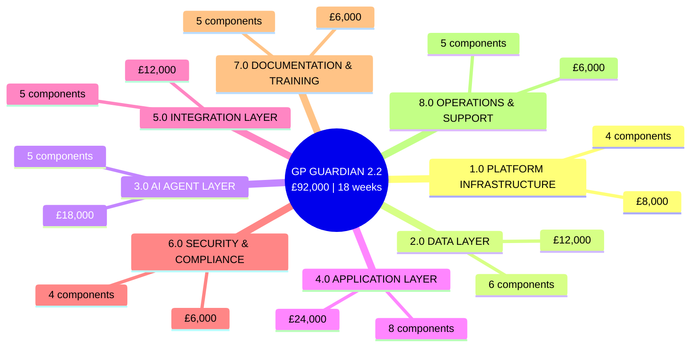

---

## 3. PBS Level 2: Component Breakdown

### 3.1 Platform Infrastructure (1.0)

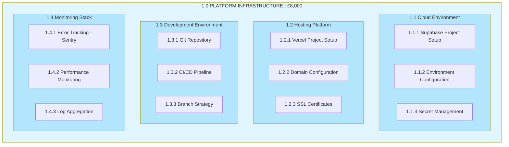

| ID | Component | Deliverables | Effort |
|----|-----------|--------------|--------|
| 1.1 | Cloud Environment | Supabase project, 3 environments, secrets | 8 hrs |
| 1.2 | Hosting Platform | Vercel deployment, custom domain, SSL | 6 hrs |
| 1.3 | Development Environment | Git repo, CI/CD, branch protection | 8 hrs |
| 1.4 | Monitoring Stack | Sentry, performance dashboards, logs | 10 hrs |

---

### 3.2 Data Layer (2.0)

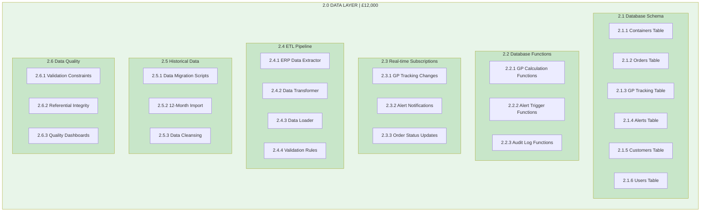

| ID | Component | Deliverables | Effort |
|----|-----------|--------------|--------|
| 2.1 | Database Schema | 6 tables, indexes, constraints | 16 hrs |
| 2.2 | Database Functions | GP calc, triggers, audit | 12 hrs |
| 2.3 | Real-time Subscriptions | 3 subscription channels | 8 hrs |
| 2.4 | ETL Pipeline | Extract, transform, load, validate | 24 hrs |
| 2.5 | Historical Data | Migration, import, cleansing | 16 hrs |
| 2.6 | Data Quality | Constraints, integrity, monitoring | 8 hrs |

---

### 3.3 AI Agent Layer (3.0)

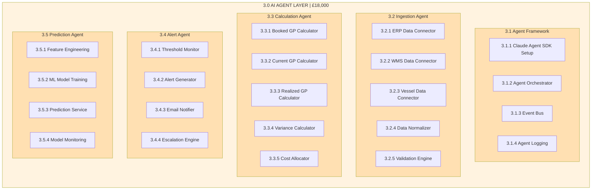

| ID | Component | Deliverables | Phase | Effort |
|----|-----------|--------------|-------|--------|
| 3.1 | Agent Framework | SDK setup, orchestrator, events | MVP | 16 hrs |
| 3.2 | Ingestion Agent | 3 connectors, normalizer, validator | MVP | 24 hrs |
| 3.3 | Calculation Agent | 5 calculators, cost allocation | MVP | 20 hrs |
| 3.4 | Alert Agent | Monitor, generator, notifier | MVP | 16 hrs |
| 3.5 | Prediction Agent | ML model, prediction service | Phase 2 | 32 hrs |

---

### 3.4 Application Layer (4.0)

```mermaid
flowchart TB
    subgraph AP4["4.0 APPLICATION LAYER | £24,000"]
        direction TB
        
        subgraph AP41["4.1 Core Framework"]
            AP411[4.1.1 Next.js 14 Setup]
            AP412[4.1.2 App Router Config]
            AP413[4.1.3 TypeScript Config]
            AP414[4.1.4 Tailwind Setup]
        end
        
        subgraph AP42["4.2 UI Component Library"]
            AP421[4.2.1 Shadcn/ui Integration]
            AP422[4.2.2 WWG Design Tokens]
            AP423[4.2.3 Common Components]
            AP424[4.2.4 Chart Components]
        end
        
        subgraph AP43["4.3 Dashboard Module"]
            AP431[4.3.1 KPI Cards]
            AP432[4.3.2 GP Trend Chart]
            AP433[4.3.3 Top Variance Table]
            AP434[4.3.4 Segment Breakdown]
            AP435[4.3.5 Date Range Filter]
        end
        
        subgraph AP44["4.4 Order Management Module"]
            AP441[4.4.1 Order List View]
            AP442[4.4.2 Order Detail View]
            AP443[4.4.3 Order Filters]
            AP444[4.4.4 Order Search]
            AP445[4.4.5 GP Breakdown Panel]
        end
        
        subgraph AP45["4.5 Container Module"]
            AP451[4.5.1 Container List View]
            AP452[4.5.2 Container Detail View]
            AP453[4.5.3 Storage Timeline]
            AP454[4.5.4 Order Allocation View]
        end
        
        subgraph AP46["4.6 Alert Module"]
            AP461[4.6.1 Alert Center]
            AP462[4.6.2 Alert Cards]
            AP463[4.6.3 Acknowledgment Flow]
            AP464[4.6.4 Alert History]
        end
        
        subgraph AP47["4.7 Reports Module"]
            AP471[4.7.1 Export Configuration]
            AP472[4.7.2 CSV Generator]
            AP473[4.7.3 Report Templates]
            AP474[4.7.4 Scheduled Reports]
        end
        
        subgraph AP48["4.8 Settings Module"]
            AP481[4.8.1 User Profile]
            AP482[4.8.2 Alert Thresholds]
            AP483[4.8.3 Notification Preferences]
            AP484[4.8.4 System Configuration]
        end
    end
    
    style AP4 fill:#fce4ec
    style AP41 fill:#f8bbd9
    style AP42 fill:#f8bbd9
    style AP43 fill:#f8bbd9
    style AP44 fill:#f8bbd9
    style AP45 fill:#f8bbd9
    style AP46 fill:#f8bbd9
    style AP47 fill:#f8bbd9
    style AP48 fill:#f8bbd9
```

| ID | Component | Deliverables | Priority | Effort |
|----|-----------|--------------|----------|--------|
| 4.1 | Core Framework | Next.js, TypeScript, Tailwind | Must | 8 hrs |
| 4.2 | UI Component Library | Shadcn, tokens, charts | Must | 16 hrs |
| 4.3 | Dashboard Module | 5 components | Must | 24 hrs |
| 4.4 | Order Management Module | 5 views/components | Must | 32 hrs |
| 4.5 | Container Module | 4 views | Should | 16 hrs |
| 4.6 | Alert Module | 4 components | Must | 20 hrs |
| 4.7 | Reports Module | 4 features | Should | 12 hrs |
| 4.8 | Settings Module | 4 screens | Should | 8 hrs |

---

### 3.5 Integration Layer (5.0)

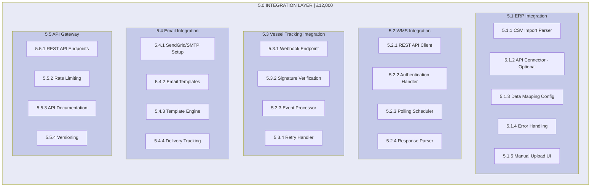

| ID | Component | Deliverables | Effort |
|----|-----------|--------------|--------|
| 5.1 | ERP Integration | CSV parser, mapper, upload UI | 24 hrs |
| 5.2 | WMS Integration | API client, scheduler, parser | 16 hrs |
| 5.3 | Vessel Tracking | Webhook, verification, processor | 12 hrs |
| 5.4 | Email Integration | Templates, engine, tracking | 12 hrs |
| 5.5 | API Gateway | Endpoints, docs, versioning | 16 hrs |

---

### 3.6 Security & Compliance (6.0)

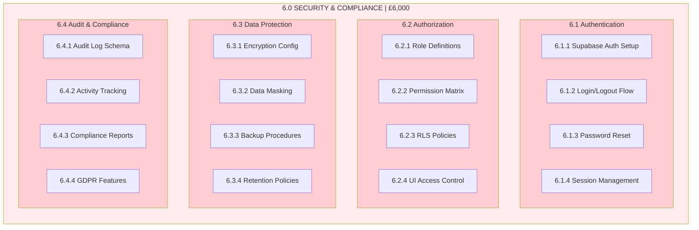

| ID | Component | Deliverables | Effort |
|----|-----------|--------------|--------|
| 6.1 | Authentication | Auth setup, flows, sessions | 12 hrs |
| 6.2 | Authorization | Roles, permissions, RLS | 16 hrs |
| 6.3 | Data Protection | Encryption, backup, retention | 8 hrs |
| 6.4 | Audit & Compliance | Logging, tracking, GDPR | 12 hrs |

---

### 3.7 Documentation & Training (7.0)

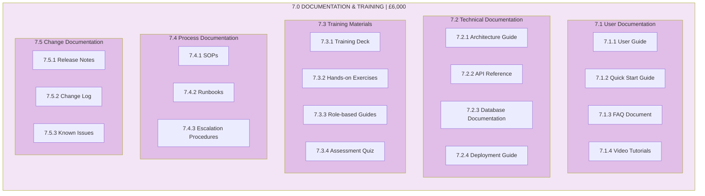

| ID | Component | Deliverables | Effort |
|----|-----------|--------------|--------|
| 7.1 | User Documentation | Guide, FAQ, videos | 16 hrs |
| 7.2 | Technical Documentation | Architecture, API, DB docs | 12 hrs |
| 7.3 | Training Materials | Deck, exercises, assessments | 16 hrs |
| 7.4 | Process Documentation | SOPs, runbooks | 8 hrs |
| 7.5 | Change Documentation | Release notes, changelog | 4 hrs |

---

### 3.8 Operations & Support (8.0)

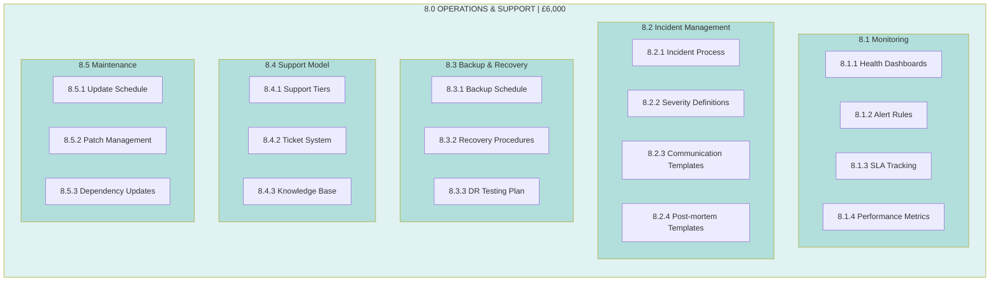

| ID | Component | Deliverables | Effort |
|----|-----------|--------------|--------|
| 8.1 | Monitoring | Dashboards, alerts, SLA | 12 hrs |
| 8.2 | Incident Management | Process, templates | 8 hrs |
| 8.3 | Backup & Recovery | Schedule, procedures, DR | 8 hrs |
| 8.4 | Support Model | Tiers, ticketing, KB | 8 hrs |
| 8.5 | Maintenance | Schedules, patching | 8 hrs |

---

## 4. PBS by Phase

### Phase Allocation

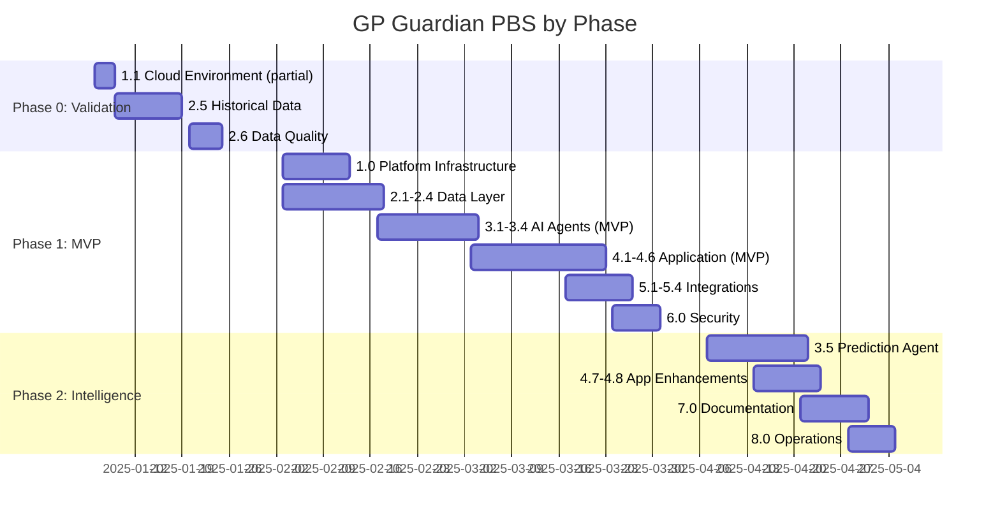

### Phase 0: Validation (£15,000 | 4 weeks)

| PBS ID | Component | Deliverables |
|--------|-----------|--------------|
| 1.1.1 | Supabase Project Setup | Dev environment only |
| 2.5.1-3 | Historical Data | Migration, import, cleansing |
| 2.6.1-3 | Data Quality | Validation, quality report |
| 3.3.1-4 | Calculation Logic | GP formulas (prototype) |

**Phase 0 Gate Deliverables:**
- [ ] Data quality report (>80% usable)
- [ ] £450K leak validation report
- [ ] Simulation model
- [ ] Go/No-Go recommendation

---

### Phase 1: MVP (£45,000 | 8 weeks)

| PBS ID | Component | Sprint |
|--------|-----------|--------|
| 1.1-1.4 | Platform Infrastructure | Sprint 1 |
| 2.1-2.4 | Database & ETL | Sprint 1 |
| 3.1-3.4 | AI Agents (Ingestion, Calc, Alert) | Sprint 2 |
| 4.1-4.2 | Core Framework & Components | Sprint 2 |
| 4.3 | Dashboard Module | Sprint 3 |
| 4.4 | Order Management Module | Sprint 3 |
| 4.6 | Alert Module | Sprint 3 |
| 5.1-5.4 | Integrations | Sprint 4 |
| 6.1-6.4 | Security & Compliance | Sprint 4 |

**MVP Gate Deliverables:**
- [ ] Three-stage GP tracking operational
- [ ] Dashboard with real-time data
- [ ] Alert system functional
- [ ] 20-order pilot complete
- [ ] NPS >50 from pilot users

---

### Phase 2: Intelligence (£32,000 | 6 weeks)

| PBS ID | Component | Week |
|--------|-----------|------|
| 3.5 | Prediction Agent | Weeks 1-2 |
| 4.5 | Container Module (enhanced) | Week 2 |
| 4.7 | Reports Module | Week 3 |
| 4.8 | Settings Module | Week 3 |
| 7.1-7.5 | Documentation & Training | Weeks 4-5 |
| 8.1-8.5 | Operations & Support | Weeks 5-6 |

**Phase 2 Gate Deliverables:**
- [ ] Prediction model MAPE <15%
- [ ] Full documentation complete
- [ ] Training delivered
- [ ] Operations handover complete

---

## 5. PBS Work Package Details

### 5.1 Critical Path Work Packages

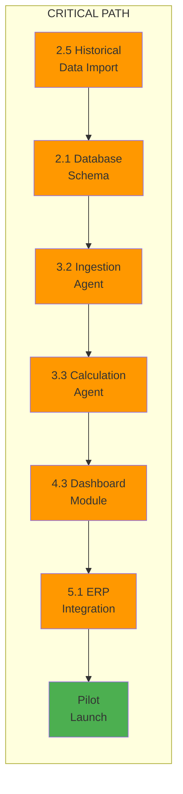

### 5.2 Work Package Summary Table

| WP ID | Name | Inputs | Outputs | Dependencies | Effort | Owner |
|-------|------|--------|---------|--------------|--------|-------|
| **2.1** | Database Schema | Data model design | 6 tables created | None | 16 hrs | Dev |
| **2.4** | ETL Pipeline | ERP specs | Working pipeline | 2.1 | 24 hrs | Dev |
| **2.5** | Historical Data | ERP exports | 12-month dataset | 2.1, 2.4 | 16 hrs | Dev + Ops |
| **3.1** | Agent Framework | SDK docs | Orchestrator running | 1.1 | 16 hrs | Dev |
| **3.2** | Ingestion Agent | Data sources | Normalized data | 3.1, 2.4 | 24 hrs | Dev |
| **3.3** | Calculation Agent | GP formulas | GP tracking records | 3.1, 3.2 | 20 hrs | Dev |
| **3.4** | Alert Agent | Thresholds | Alert notifications | 3.1, 3.3 | 16 hrs | Dev |
| **4.3** | Dashboard Module | UI designs | Dashboard UI | 4.1, 4.2 | 24 hrs | Dev |
| **4.4** | Order Management | UI designs | Order views | 4.1, 4.2 | 32 hrs | Dev |
| **5.1** | ERP Integration | ERP specs | Data flowing | 2.4, 3.2 | 24 hrs | Dev + IT |

---

## 6. PBS Deliverable Checklist

### 6.1 Phase 0 Deliverables

| # | Deliverable | Type | Acceptance Criteria |
|---|-------------|------|---------------------|
| 1 | Supabase dev environment | Infrastructure | Project accessible |
| 2 | Data extraction scripts | Code | ERP data extracted |
| 3 | Historical dataset (12 months) | Data | >80% quality |
| 4 | Data quality report | Document | Metrics documented |
| 5 | Simulation model | Code | £450K validated ±20% |
| 6 | Validation report | Document | Go/No-Go recommendation |

### 6.2 Phase 1 Deliverables

| # | Deliverable | Type | Acceptance Criteria |
|---|-------------|------|---------------------|
| 7 | Production Supabase project | Infrastructure | All environments configured |
| 8 | Database schema | Database | All tables, indexes, RLS |
| 9 | ETL pipeline | Code | 4-hour refresh working |
| 10 | Ingestion Agent | AI Agent | Data normalized |
| 11 | Calculation Agent | AI Agent | GP calculated correctly |
| 12 | Alert Agent | AI Agent | Alerts triggering |
| 13 | Next.js application | Code | Deployed to Vercel |
| 14 | Dashboard UI | UI | All KPIs displaying |
| 15 | Order List View | UI | Filterable, sortable |
| 16 | Order Detail View | UI | GP breakdown shown |
| 17 | Alert Center | UI | Alerts manageable |
| 18 | ERP integration | Integration | Data flowing daily |
| 19 | WMS integration | Integration | Storage days updating |
| 20 | Email notifications | Integration | Critical alerts sent |
| 21 | Authentication system | Security | Login working |
| 22 | RBAC implementation | Security | Roles enforced |
| 23 | Pilot completion report | Document | 20 orders tracked |

### 6.3 Phase 2 Deliverables

| # | Deliverable | Type | Acceptance Criteria |
|---|-------------|------|---------------------|
| 24 | Prediction Agent | AI Agent | MAPE <15% |
| 25 | Container Module | UI | Storage tracking |
| 26 | Reports Module | UI | CSV export working |
| 27 | Settings Module | UI | Thresholds configurable |
| 28 | User Guide | Document | Complete, reviewed |
| 29 | Technical Documentation | Document | Architecture, API docs |
| 30 | Training Materials | Document | Deck, exercises |
| 31 | Training Delivery | Training | All users trained |
| 32 | Operations Runbook | Document | Procedures documented |
| 33 | Support Handover | Handover | L1/L2 ready |

---

## 7. PBS Resource Allocation

### 7.1 Resource Requirements by Component

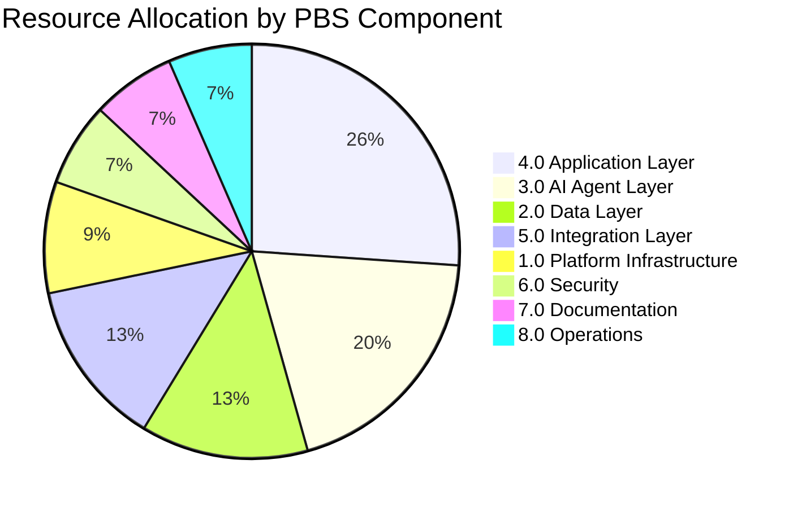

### 7.2 Team Allocation

| Role | PBS Components | Allocation |
|------|----------------|------------|
| Technical Lead | 3.0, 4.0, Architecture | 100% |
| Full-stack Developer | 2.0, 4.0, 5.0 | 100% |
| Project Manager | All (coordination) | 50% |
| Business Analyst | 7.0, UAT | 25% |
| Operations SME | 2.5, 5.1, 8.0 | 25% |
| IT Support | 1.0, 5.1, 6.0 | 25% |

---

## 8. PBS to WBS Mapping

The PBS focuses on **what** is delivered. The Work Breakdown Structure (WBS) focuses on **how** work is organized. Here is the mapping:

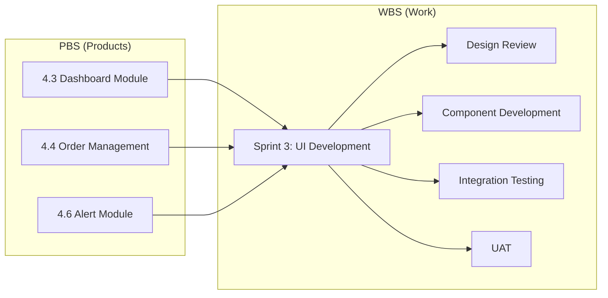

---

## 9. PBS Quality Gates

### 9.1 Component Acceptance Criteria

| PBS Level 1 | Quality Gate | Criteria |
|-------------|--------------|----------|
| 1.0 Platform | Infrastructure Review | All environments accessible, CI/CD working |
| 2.0 Data | Data Quality Review | >80% data quality, schema validated |
| 3.0 AI Agents | Agent Testing | Unit tests pass, accuracy metrics met |
| 4.0 Application | UI/UX Review | Design compliance, accessibility |
| 5.0 Integration | Integration Testing | All connections verified |
| 6.0 Security | Security Review | Pen test passed, RLS verified |
| 7.0 Documentation | Doc Review | Complete, accurate, approved |
| 8.0 Operations | Ops Readiness | Runbooks tested, team trained |

### 9.2 Phase Gate Reviews

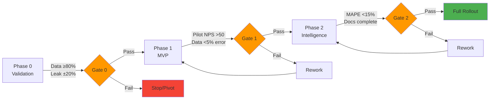

---

## 10. Appendix: Complete PBS Code List

| Level 1 | Level 2 | Level 3 | Description |
|---------|---------|---------|-------------|
| 1.0 | | | **Platform Infrastructure** |
| | 1.1 | | Cloud Environment |
| | | 1.1.1 | Supabase Project Setup |
| | | 1.1.2 | Environment Configuration |
| | | 1.1.3 | Secret Management |
| | 1.2 | | Hosting Platform |
| | | 1.2.1 | Vercel Project Setup |
| | | 1.2.2 | Domain Configuration |
| | | 1.2.3 | SSL Certificates |
| | 1.3 | | Development Environment |
| | | 1.3.1 | Git Repository |
| | | 1.3.2 | CI/CD Pipeline |
| | | 1.3.3 | Branch Strategy |
| | 1.4 | | Monitoring Stack |
| | | 1.4.1 | Error Tracking |
| | | 1.4.2 | Performance Monitoring |
| | | 1.4.3 | Log Aggregation |
| 2.0 | | | **Data Layer** |
| | 2.1 | | Database Schema |
| | | 2.1.1 | Containers Table |
| | | 2.1.2 | Orders Table |
| | | 2.1.3 | GP Tracking Table |
| | | 2.1.4 | Alerts Table |
| | | 2.1.5 | Customers Table |
| | | 2.1.6 | Users Table |
| | 2.2 | | Database Functions |
| | | 2.2.1 | GP Calculation Functions |
| | | 2.2.2 | Alert Trigger Functions |
| | | 2.2.3 | Audit Log Functions |
| | 2.3 | | Real-time Subscriptions |
| | | 2.3.1 | GP Tracking Changes |
| | | 2.3.2 | Alert Notifications |
| | | 2.3.3 | Order Status Updates |
| | 2.4 | | ETL Pipeline |
| | | 2.4.1 | ERP Data Extractor |
| | | 2.4.2 | Data Transformer |
| | | 2.4.3 | Data Loader |
| | | 2.4.4 | Validation Rules |
| | 2.5 | | Historical Data |
| | | 2.5.1 | Data Migration Scripts |
| | | 2.5.2 | 12-Month Import |
| | | 2.5.3 | Data Cleansing |
| | 2.6 | | Data Quality |
| | | 2.6.1 | Validation Constraints |
| | | 2.6.2 | Referential Integrity |
| | | 2.6.3 | Quality Dashboards |
| 3.0 | | | **AI Agent Layer** |
| | 3.1 | | Agent Framework |
| | | 3.1.1 | Claude Agent SDK Setup |
| | | 3.1.2 | Agent Orchestrator |
| | | 3.1.3 | Event Bus |
| | | 3.1.4 | Agent Logging |
| | 3.2 | | Ingestion Agent |
| | | 3.2.1 | ERP Data Connector |
| | | 3.2.2 | WMS Data Connector |
| | | 3.2.3 | Vessel Data Connector |
| | | 3.2.4 | Data Normalizer |
| | | 3.2.5 | Validation Engine |
| | 3.3 | | Calculation Agent |
| | | 3.3.1 | Booked GP Calculator |
| | | 3.3.2 | Current GP Calculator |
| | | 3.3.3 | Realized GP Calculator |
| | | 3.3.4 | Variance Calculator |
| | | 3.3.5 | Cost Allocator |
| | 3.4 | | Alert Agent |
| | | 3.4.1 | Threshold Monitor |
| | | 3.4.2 | Alert Generator |
| | | 3.4.3 | Email Notifier |
| | | 3.4.4 | Escalation Engine |
| | 3.5 | | Prediction Agent |
| | | 3.5.1 | Feature Engineering |
| | | 3.5.2 | ML Model Training |
| | | 3.5.3 | Prediction Service |
| | | 3.5.4 | Model Monitoring |
| 4.0 | | | **Application Layer** |
| | 4.1 | | Core Framework |
| | | 4.1.1 | Next.js 14 Setup |
| | | 4.1.2 | App Router Config |
| | | 4.1.3 | TypeScript Config |
| | | 4.1.4 | Tailwind Setup |
| | 4.2 | | UI Component Library |
| | | 4.2.1 | Shadcn/ui Integration |
| | | 4.2.2 | WWG Design Tokens |
| | | 4.2.3 | Common Components |
| | | 4.2.4 | Chart Components |
| | 4.3 | | Dashboard Module |
| | | 4.3.1 | KPI Cards |
| | | 4.3.2 | GP Trend Chart |
| | | 4.3.3 | Top Variance Table |
| | | 4.3.4 | Segment Breakdown |
| | | 4.3.5 | Date Range Filter |
| | 4.4 | | Order Management Module |
| | | 4.4.1 | Order List View |
| | | 4.4.2 | Order Detail View |
| | | 4.4.3 | Order Filters |
| | | 4.4.4 | Order Search |
| | | 4.4.5 | GP Breakdown Panel |
| | 4.5 | | Container Module |
| | | 4.5.1 | Container List View |
| | | 4.5.2 | Container Detail View |
| | | 4.5.3 | Storage Timeline |
| | | 4.5.4 | Order Allocation View |
| | 4.6 | | Alert Module |
| | | 4.6.1 | Alert Center |
| | | 4.6.2 | Alert Cards |
| | | 4.6.3 | Acknowledgment Flow |
| | | 4.6.4 | Alert History |
| | 4.7 | | Reports Module |
| | | 4.7.1 | Export Configuration |
| | | 4.7.2 | CSV Generator |
| | | 4.7.3 | Report Templates |
| | | 4.7.4 | Scheduled Reports |
| | 4.8 | | Settings Module |
| | | 4.8.1 | User Profile |
| | | 4.8.2 | Alert Thresholds |
| | | 4.8.3 | Notification Preferences |
| | | 4.8.4 | System Configuration |
| 5.0 | | | **Integration Layer** |
| | 5.1 | | ERP Integration |
| | | 5.1.1 | CSV Import Parser |
| | | 5.1.2 | API Connector (Optional) |
| | | 5.1.3 | Data Mapping Config |
| | | 5.1.4 | Error Handling |
| | | 5.1.5 | Manual Upload UI |
| | 5.2 | | WMS Integration |
| | | 5.2.1 | REST API Client |
| | | 5.2.2 | Authentication Handler |
| | | 5.2.3 | Polling Scheduler |
| | | 5.2.4 | Response Parser |
| | 5.3 | | Vessel Tracking |
| | | 5.3.1 | Webhook Endpoint |
| | | 5.3.2 | Signature Verification |
| | | 5.3.3 | Event Processor |
| | | 5.3.4 | Retry Handler |
| | 5.4 | | Email Integration |
| | | 5.4.1 | SendGrid/SMTP Setup |
| | | 5.4.2 | Email Templates |
| | | 5.4.3 | Template Engine |
| | | 5.4.4 | Delivery Tracking |
| | 5.5 | | API Gateway |
| | | 5.5.1 | REST API Endpoints |
| | | 5.5.2 | Rate Limiting |
| | | 5.5.3 | API Documentation |
| | | 5.5.4 | Versioning |
| 6.0 | | | **Security & Compliance** |
| | 6.1 | | Authentication |
| | | 6.1.1 | Supabase Auth Setup |
| | | 6.1.2 | Login/Logout Flow |
| | | 6.1.3 | Password Reset |
| | | 6.1.4 | Session Management |
| | 6.2 | | Authorization |
| | | 6.2.1 | Role Definitions |
| | | 6.2.2 | Permission Matrix |
| | | 6.2.3 | RLS Policies |
| | | 6.2.4 | UI Access Control |
| | 6.3 | | Data Protection |
| | | 6.3.1 | Encryption Config |
| | | 6.3.2 | Data Masking |
| | | 6.3.3 | Backup Procedures |
| | | 6.3.4 | Retention Policies |
| | 6.4 | | Audit & Compliance |
| | | 6.4.1 | Audit Log Schema |
| | | 6.4.2 | Activity Tracking |
| | | 6.4.3 | Compliance Reports |
| | | 6.4.4 | GDPR Features |
| 7.0 | | | **Documentation & Training** |
| | 7.1 | | User Documentation |
| | | 7.1.1 | User Guide |
| | | 7.1.2 | Quick Start Guide |
| | | 7.1.3 | FAQ Document |
| | | 7.1.4 | Video Tutorials |
| | 7.2 | | Technical Documentation |
| | | 7.2.1 | Architecture Guide |
| | | 7.2.2 | API Reference |
| | | 7.2.3 | Database Documentation |
| | | 7.2.4 | Deployment Guide |
| | 7.3 | | Training Materials |
| | | 7.3.1 | Training Deck |
| | | 7.3.2 | Hands-on Exercises |
| | | 7.3.3 | Role-based Guides |
| | | 7.3.4 | Assessment Quiz |
| | 7.4 | | Process Documentation |
| | | 7.4.1 | SOPs |
| | | 7.4.2 | Runbooks |
| | | 7.4.3 | Escalation Procedures |
| | 7.5 | | Change Documentation |
| | | 7.5.1 | Release Notes |
| | | 7.5.2 | Change Log |
| | | 7.5.3 | Known Issues |
| 8.0 | | | **Operations & Support** |
| | 8.1 | | Monitoring |
| | | 8.1.1 | Health Dashboards |
| | | 8.1.2 | Alert Rules |
| | | 8.1.3 | SLA Tracking |
| | | 8.1.4 | Performance Metrics |
| | 8.2 | | Incident Management |
| | | 8.2.1 | Incident Process |
| | | 8.2.2 | Severity Definitions |
| | | 8.2.3 | Communication Templates |
| | | 8.2.4 | Post-mortem Templates |
| | 8.3 | | Backup & Recovery |
| | | 8.3.1 | Backup Schedule |
| | | 8.3.2 | Recovery Procedures |
| | | 8.3.3 | DR Testing Plan |
| | 8.4 | | Support Model |
| | | 8.4.1 | Support Tiers |
| | | 8.4.2 | Ticket System |
| | | 8.4.3 | Knowledge Base |
| | 8.5 | | Maintenance |
| | | 8.5.1 | Update Schedule |
| | | 8.5.2 | Patch Management |
| | | 8.5.3 | Dependency Updates |

---

## Document Control

| Version | Date | Author | Changes |
|---------|------|--------|---------|
| 1.0.0 | Dec 4, 2025 | AI/BI Transformation Team | Initial PBS |

---

**Approval Signatures:**

| Role | Name | Signature | Date |
|------|------|-----------|------|
| Product Owner | | | |
| Technical Lead | | | |
| Project Manager | | | |
